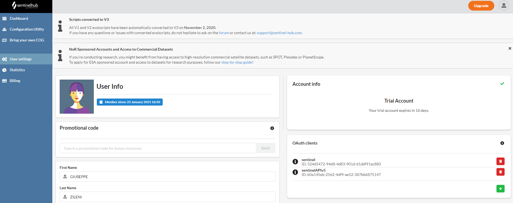

# SENTINEL5P API
Sentinel API permette di ricevere da Sentinel HUB dati da [Sentinel-5P by ESA](http://www.tropomi.eu/data-products/level-2-products), satellite per misurare la qualità dell'aria dallo spazio.

## INSTALLATION
```
    git clone https://github.com/gzileni/sentinelAPI.git
    cd sentinelAPI
    yarn install
```

## Authentication
E' necessario registrarsi a [Sentinel HUB](https://www.sentinel-hub.com/) per poter configurare il client OAuth


### CREATE .ENV FILE
Creare il file .env con le variabili per accedere a Sentinel HUB

```
    cd sentinelAPI
    nano .env    
```
Aggiungere righe con 

- CLIENT_ID       =   YOUR CLIENT ID
- CLIENT_SECRET   =   YOUR CLIENT SECRET

## RUN
```
yarn start
```

## DOCKER
```
$ docker build -t yourusername/sentinelAPI .
$ docker run -p3000:3000 yourusername/sentinelAPI
```

## GET TOKEN
Restituisce il Token di autorizzazione per accedere ai dati di [Sentinel HUB](https://www.sentinel-hub.com/)

**POST /api/v1/auth**

### Esempio

```
var formdata = new FormData();
formdata.append("clientID", "");
formdata.append("clientSecret", "");

var requestOptions = {
  method: 'POST',
  body: formdata,
  redirect: 'follow'
};

fetch("http://localhost:3000/api/v1/auth", requestOptions)
  .then(response => response.text())
  .then(result => console.log(result))
  .catch(error => console.log('error', error));
```

## Get Image S5P
Restituisce l'immagine del satellite Sentinel da visualizzare sul client in formato PNG

**POST /api/v1/process**

### Esempio
```
var myHeaders = new Headers();
myHeaders.append("Content-Type", "application/x-www-form-urlencoded");

var urlencoded = new URLSearchParams();
urlencoded.append("clientID", "<YOUR CLIENT ID>");
urlencoded.append("clientSecret", "<YOUR CLIENT SECRET>");
urlencoded.append("evalscript", "\"CO\"");
urlencoded.append("bbox", "[13,45,15,47]");
urlencoded.append("fromUTC", "\"2019-04-01T00:00:00Z\"");
urlencoded.append("toUTC", "\"2019-06-30T00:00:00Z\"");
urlencoded.append("width", "512");
urlencoded.append("height", "512");
urlencoded.append("base64", "true");

var requestOptions = {
  method: 'POST',
  headers: myHeaders,
  body: urlencoded,
  redirect: 'follow'
};

fetch("http://localhost:3000/api/v1/sentinel/process", requestOptions)
  .then(response => response.text())
  .then(result => console.log(result))
  .catch(error => console.log('error', error));
```

## Get EvalScript
Restituisce lo script personalizzato per l'elaborazione dei dati satellitari

**/api/v1/process?evalscript=**

### Esempio
```
var raw = "";

var requestOptions = {
  method: 'GET',
  body: raw,
  redirect: 'follow'
};

fetch("http://localhost:3000/api/v1/process/?evalscript=CO", requestOptions)
  .then(response => response.text())
  .then(result => console.log(result))
  .catch(error => console.log('error', error));
```

## Evalscipts
Gli script personalizzati [EVALSCRPT V3](https://docs.sentinel-hub.com/api/latest/evalscript/v3/) sono codici Javascript richiesti per elaborare i dati satellitari da Sentinel Hub e quali valori il servizio restituirà.
Nei parametri dei metodi delle richieste HTTP si possono specificare una serie di script come i seguenti:

- NO2      [Nitrogen Dioxide](http://www.tropomi.eu/data-products/nitrogen-dioxide)
- NO22     [Nitrogen Dioxide (NO2) script by Annamaria Luongo](https://custom-scripts.sentinel-hub.com/sentinel-5p/nitrogen_dioxide_tropospheric_column/)
- SO2      [Sulfur Dioxide](http://www.tropomi.eu/data-products/sulphur-dioxide)
- HCHO     [Formaldehyde](http://www.tropomi.eu/data-products/formaldehyde)
- O3       [Ozone](http://www.tropomi.eu/data-products/total-ozone-column)
- CH4      [Methane](http://www.tropomi.eu/data-products/methane)
- AS1      [UV (Ultraviolet) Aerosol Index calculated based on wavelengths of 340 nm and 380 nm](http://www.tropomi.eu/data-products/uv-aerosol-index)
- AS2      [UV (Ultraviolet) Aerosol Index calculated based on wavelengths of 354 nm and 388 nm](http://www.tropomi.eu/data-products/uv-aerosol-index)
- CLOUD1   [Cloud base height](http://www.tropomi.eu/data-products/carbon-monoxide)
- CLOUD2   [Cloud base pressure](http://www.tropomi.eu/data-products/carbon-monoxide)
- CLOUD3   [Cloud optical thickness](http://www.tropomi.eu/data-products/carbon-monoxide)
- CLOUD4   [Cloud top height](http://www.tropomi.eu/data-products/carbon-monoxide)
- CLOUD5   [Cloud top pressure](http://www.tropomi.eu/data-products/carbon-monoxide)
- CLOUD6   [Effective radiometric cloud fraction](http://www.tropomi.eu/data-products/carbon-monoxide)
- CO        (default) [CARBON Monoxide](http://www.tropomi.eu/data-products/carbon-monoxide)
