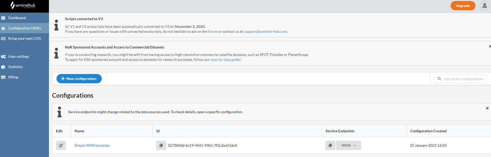

# SENTINEL5P API
[Sentinel-5P by ESA](http://www.tropomi.eu/data-products/level-2-products) Measuring Air Pollution from Space.

## INSTALLATION
```
git clone https://github.com/gzileni/sentinelAPI.git
cd sentinelAPI
yarn install
```

### CREATE .ENV FILE
```
cd sentinelAPI
nano .env    
```
by [SENTINEL HUB DASHBOARD](https://services.sentinel-hub.com/)



- INSTANCE_ID     =   <YOUR INSTANCE ID>


- CLIENT_ID       =   <YOUR CLIENT ID>
- CLIENT_SECRET   =   <YOUR CLIENT SECRET>

## RUN
```
yarn start
```

## GET TOKEN
```
POST /api/v1/auth

clientID        // 
clientSecret    //
```

## Get Image S5P

```
POST /api/v1/process  

clientID        // 
clientSecret    //
base64          // (True or False) for client image or false to only buffer data to display image on PostMan
width           // 512px default
height          // 512px default
fromUTC         // from date format UTC (2018-12-28T00:00:00Z)
toUTC           // to date format UTC
data            // evalscript data
```

## Get EvalScript
```
GET /api/v1/process/:data

data            // evalscript data
```

## EVALSCRIPTS DATA

```
NO2         // S5P Nitrogen Dioxide (NO2)
NO22        // S5P Nitrogen Dioxide (NO2) script by Annamaria Luongo
SO2         // S5P Sulfur Dioxide (SO2)
HCHO        // S5P Formaldehyde (HCHO)
O3          // S5P Ozone (O3)
CH4         // S5P Methane (CH4)
AS1         // S5P Aerosol Index 340 and 380
AS2         // S5P Aerosol Index 354 and 388
CLOUD1      // S5P Cloud Base Height
CLOUD2      // S5P Cloud Base Pressure
CLOUD3      // S5P Cloud Optical Thickness
CLOUD4      // S5P Cloud Top Height
CLOUD5      // S5P Cloud Top Pressure
CLOUD6      // S5P Effective radiometric cloud fraction
CO          // (default) S5P CARBON Monoxide 
```